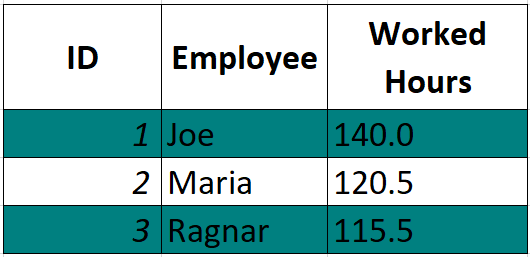

# Reflective Excel Writer

Reflective Excel Writer allows mapping of Java objects to Excel sheets. To provide an idea
of what is possible, we will showcase each feature in the next sections.

## Table of contents

  * [Fixed columns](#fixed-columns)
  * [Dynamic columns](#dynamic-columns)
  * [Grouped columns](#grouped-columns)
  * [Writing settings](#writing-settings)
    * [Table location](#table-location)
    * [Template file](#template-file)
  * [Serializing cell values](#serializing-cell-values)
    * [Default serializers](#default-serializers)
    * [Custom Serializer](#custom-serializer)
  * [Table and cell styling](#table-and-cell-styling)
    * [Column width](#column-width)
    * [Data Filter](#data-filter)
  * [Writing more than one table](#writing-more-than-one-table)
    * [Writing multiple tables](#writing-multiple-tables)
    * [Writing a cell value](#writing-a-cell-value)
    * [Writing properties with values](#writing-properties-with-values)

## Fixed columns

Let's say we want to write the following table to the sheet:

| **ID** | **Employee** | **Worked hours** |
|--------|--------------|------------------|
| 1      | Joe          | 140              |
| 2      | Maria        | 120.5            |

The corresponding class will look as follows:

```java
class EmployeeRow {

    @ExcelColumn("ID")
    private Integer id;

    @ExcelColumn("Employee")
    private String name;

    @ExcelColumn("Worked hours")
    private Double workedHours;
    
    // all-args constructor...
}
```

To write the table rows, call `ReflectiveExcelWriter#writeRows`. For our example:

```java
EmployeeRow row1 = new EmployeeRow(1, "Joe", 140);
EmployeeRow row2 = new EmployeeRow(2, "Maria", 120.5);
new ReflectiveExcelWriter(file).writeRows(List.of(row1, row2), EmployeeRow.class);
```

## Dynamic columns

Now, let's say that we would like to have in the table the amount of hours an employee has worked each day
of a month. In this case, these columns are "dynamic", as they vary between 28 and 31, depending on the month and year.

| **ID** | **Employee** | **1** | **2** | **3** | ... | **31** |
|--------|--------------|-------|-------|-------|-----|--------|
| 1      | Joe          | 8     | 8     | 10    | ... | 7.5    |
| 2      | Maria        | 4.5   | 8     | 8     | ... | 8      |

The `@DynamicColumns` annotation can be used to specify these columns as follows:

```java
class EmployeeRow {

    @ExcelColumn("ID")
    private Integer id;

    @ExcelColumn("Employee")
    private String name;

    @DynamicColumns
    private Map<Integer, Double> workedHoursPerDay;
    
    // all-args constructor
}
```

The `@DynamicColumns` can only be used on `Map.class`. When writing the rows, the map keys will be written as table
headers, and the map values will be the corresponding header/column values. Note that only the first provided row is used to
write the dynamic headers, so it is your responsibility to make sure that the corresponding map(s) of all rows contain the
same keys!

Writing the rows:

```java
EmployeeRow row1 = new EmployeeRow(1, "Joe", Map.of(1, 8, 2, 8.0));
EmployeeRow row2 = new EmployeeRow(2, "Maria", Map.of(1, 4.5, 2, 8.0));
new ReflectiveExcelWriter(file).writeRows(List.of(row1, row2), EmployeeRow.class);
```

## Grouped columns

Sometimes, we want to group related columns/headers into one. For example:

<table class="tg"><thead>
  <tr>
    <th class="header-style" rowspan="2">ID</th>
    <th class="header-style" rowspan="2">Employee</th>
    <th class="tg-js8t" colspan="2">Address</th>
  </tr>
  <tr>
    <th class="tg-g9ke">Home</th>
    <th class="tg-js8t">Work</th>
  </tr></thead>
<tbody>
  <tr>
    <td class="row-style">1</td>
    <td class="row-style">Joe</td>
    <td class="row-style">Home Street A</td>
    <td class="row-style">Work Street</td>
  </tr>
  <tr>
    <td class="row-style">2</td>
    <td class="row-style">Maria</td>
    <td class="row-style">Home Street B</td>
    <td class="row-style">Work Street</td>
  </tr>
</tbody>
</table>

To achieve this, we can make use of the `@ExcelCellGroup` annotation, as follows:

```java
class EmployeeRow {

    @ExcelColumn("ID")
    private Integer id;

    @ExcelColumn("Employee")
    private String name;

    @ExcelCellGroup("Address")
    private EmployeeAddress address;
    
    // ...

    static class EmployeeAddress {

        @ExcelColumn("Home")
        private String home;

        @ExcelColumn("Work")
        private String work;

        // ...
    }
}
```

An `ExcelCellGroup` can contain fixed columns, dynamic columns, or even other cell grouping columns.

## Writing settings

Various options for customizing the writing process are defined through the `ExcelWritingSettings` and its corresponding
builder. For instance, we can provide the sheet name, using `ExcelWritingSettingsBuilder#sheetName`.
We can also provide the Excel format, using `ExcelWritingSettingsBuilder#fileFormat`. Xlsx is the default one. Xls is also supported.

Example:

```java
ExcelWritingSettings settings = ExcelWritingSettings.builder()
        .sheetName("my-sheet-name")
        .fileFormat(ExcelFileFormat.XLS)
        .build();
new ReflectiveExcelWriter(file, settings).writeRows(List.of(row1, row2), EmployeeRow.class);
```

### Table location

By default, the table is written starting in the top-left corner. We can change this by providing a 
`TableStartCellLocator` to the `ExcelWritingSettings`. Let's say that our table starts in cell "B2".

```java
TableStartCellLocator tableStartCellLocator = new TableStartCellLocator() {

        @Override
        public CellLocation getStartingCell(WritingContext context, String tableId) {
            return CellLocation.fromReference("B2");
        }
};
ExcelWritingSettings settings = ExcelWritingSettings.builder()
        .tableStartCellLocator(tableStartCellLocator)
        .build();
```

### Template file

If your sheet should have a logo, or some other fixed information, a template file can be provided using `ExcelWritingSettingsBuilder#templateFile`. 
Instead of creating an empty Excel file and writing to it, the template will be used as a base. Note that nothing in the template
is shifted. The tables are written on top of what is already there.

## Serializing cell values

### Default serializers

By default, converting the following types to a cell value is supported:

- `String`, all primitives and their corresponding wrappers.
- `BigDecimal` and `BigInteger`.
- `Date`, `LocalDate` and `LocalDateTime`.
- `java.util.Currency` – the cell value will represent the currency code.
- Other types are serialized using the `Object#toString` method.

All the default serializers are defined by the `DefaultSerializationContext`.

### Custom Serializer

If you want to define how to serialize a type `T`, you can define a custom
serializer by implementing `CellSerializer<T>` and adding it to the `SerializationContext`.

For example, let's say we want to define how to convert the `YearMonth` from the `java.time` package to a cell value. Then:

```java
class YearMonthSerializer implements CellSerializer<YearMonth> {

    @Override
    public Object serialize(WritingContext context, YearMonth value) {
        return yearMonth.getMonthValue() + "/" + yearMonth.getYear();
    }
}
```

The `CellSerializer#serialize` returns an `Object` type. This is due to the fact that not all cell values are string values.
Make sure to return a type supported by Apache POI. These are: `String`, `double`, `Date`, `LocalDate` or `LocalDateTime`.

The only thing remaining is to add the cell serializer to the `SerializationContext` and write the rows:

```java
DefaultSerializationContext serializationContext = new DefaultSerializationContext();
serializationContext.registerSerializer(YearMonth.class, new YearMonthSerializer());

ExcelWritingSettings settings = ExcelWritingSettings.builder()
        .serializationContext(serializationContext)
        .build();
new ReflectiveExcelWriter(file, settings).writeRows(List.of(row1, row2), EmployeeRow.class);
```

## Table and cell styling

Writing plain tables is boring. Let's add some color and styling. This is done through the `CellStyleContext`.
We can define styling for the following elements:
- Table header
- Table row
- Table column
- Java Type
- Sheet cell

To illustrate, assume that we want to write the following table:

<p></p>

That is:
- Table headers are bold and centered. Text-wrap is enabled.
- Odd rows have a color (first row has index zero).
- All cells have a thin border on all sides.
- Integer values have italic text.

Styles are created by the `StyleProvider`.

Defining the header style:

```java
StyleProvider headerStyleProvider = new StyleProvider() {

    @Override
    public WritableCellStyle getStyle(WritingContext context, Object target) {
        StyleFont italicFont = StyleFont.builder()
                .bold(true)
                .build();
        return WritableCellStyle.builder()
                .font(italicFont)
                .horizontalAlignment(HorizontalAlignment.CENTER)
                .verticalAlignment(VerticalAlignment.CENTER)
                .wrapText(true)
                .build();
    }
}
```

Defining the row style:

```java
StyleProvider rowStyleProvider = new StyleProvider() {

    @Override
    public WritableCellStyle getStyle(WritingContext context, Object target) {
        if (context.getCurrentTableRow() % 2 == 0) {
            return WritableCellStyle.builder()
                    .backgroundColor(new StyleColor(0, 128, 128))
                    .build();
        }
        return WritableCellStyle.builder()
                .backgroundColor(null)
                .build();
    }
}
```

Defining the cell style:

```java
StyleProvider cellStyleProvider = new StyleProvider() {

    @Override
    public WritableCellStyle getStyle(WritingContext context, Object target) {
        return WritableCellStyle.builder()
                .border(new CellBorder(BorderStyle.THIN))
                .build();
    }
}
```

Defining the type style:

```java
StyleProvider typeStyleProvider = new StyleProvider() {

    @Override
    public WritableCellStyle getStyle(WritingContext context, Object target) {
        StyleFont italicFont = StyleFont.builder()
                .italic(true)
                .build();
        return WritableCellStyle.builder()
                .font(italicFont)
                .build();
        }
    }
}
```

Writing the table:

```java
CellStyleContext styleContext = new DefaultStyleContext();
styleContext.setHeaderStyleProvider(headerStyleProvider);
styleContext.setRowStyleProvider(rowStyleProvider);
styleContext.setCellStyleProvider(cellStyleProvider);
styleContext.setTypeStyleProvider(Integer.class, typeStyleProvider);

ExcelWritingSettings settings = ExcelWritingSettings.builder()
        .cellStyleContext(styleContext)
        .build();
new ReflectiveExcelWriter(file, settings).writeRows(rows, EmployeeRow.class);
```

As you might have noticed, the style is defined through the following classes:
- StyleProvider - Creates the cell styles based on the current `WritingContext` and `target`. The `target` represents:
  - The row object, when the row style is provided.
  - The header value, when the column style is provided.
  - The cell value, when a type style is provided.
  - The cell value, when a cell style is provided.
- WritableCellStyle - Defines the cell style properties, such as:
  - Format, corresponding to "Home > Number > More number formats > Custom" in Excel
  - Horizontal alignment
  - Vertical alignment
  - Cell border
  - Background color
  - Font
  - Wrap text
- CellBorder - Part of `WritableCellStyle`. Defines border properties, such as:
  - Thickness on each side
  - Color on all sides
- StyleFont - Part of `WritableCellStyle`. Defines font properties, such as:
  - Name
  - Size
  - Color
  - Is it bold
  - Is it italic
  - Is it underlined
- StyleColor - Defines a color using rgb values.

Some style properties are very common, such as bold font, defining a background color and cell border on all sides. 
To reduce some boilerplate code, we've created utility classed that store these: `StyleProviders`, `WritableCellStyles`, 
`CellBorders` and `StyleFonts`. Using these, the previous example would become:

```java
CellStyleContext styleContext = new DefaultStyleContext();
styleContext.setHeaderStyleProvider(StyleProviders.of(WritableCellStyle.builder()
        .font(StyleFonts.bold())
        .horizontalAlignment(HorizontalAlignment.CENTER)
        .verticalAlignment(VerticalAlignment.CENTER)
        .wrapText(true)
        .build()));
styleContext.setRowStyleProvider(StyleProviders.stripedRows(new StyleColor(0, 128, 128), null));
styleContext.setCellStyleProvider(StyleProviders.of(WritableCellStyles.allSideBorder()));
styleContext.setTypeStyleProvider(Integer.class, StyleProviders.of(WritableCellStyle.builder()
        .font(StyleFonts.italic())
        .build())));
```

### Column Width

By default, the writer will adjust all column widths automatically by trying to make sure that the longest
text from each column fits. Specifying custom column widths is possible using the `@ColumnSize` annotation. 
The unit used is the same as the default one is Excel, meaning that the specified size is approximately equal to the 
number of characters that will fit in the column.

Let's say we want all column sizes to be `50`. Then:

```java
class EmployeeRow {

    @ColumnSize(preferred = 50)
    @ExcelColumn("ID")
    private Integer id;

    @ColumnSize(preferred = 50)
    @ExcelColumn("Employee")
    private String name;
}
```

`@ColumnSize` also gives the option of providing a minimum and maximum column size. This is useful if you don't
want the automatically calculated column width to be below or above a certain limit. 

The sizing can be applied on fixed and dynamic columns.
When dynamic columns are annotated, the specified sizing will be applied to each of the dynamic columns.

### Data Filter

Turning on data filtering for the table can be done using the `@InstallFilter` annotation on top of class corresponding
to the table. In Excel, this is activated via "Data Tab" > "Filter". Note that only one table can
have this filter applied.

## Writing more than one table

Besides writing one table, we can write multiple tables at once, as well as values outside tables.
This is done through the `ReflectiveExcelWriter#write` method.

### Writing multiple tables

We can write multiple tables by using the `@TableId` annotation on the list of rows. Assuming we have an employee table, where the corresponding
java type is `EmployeeRow`, as well a vacation table, with the corresponding type `VacationRow`:

```java
class EmployeeSheet {

  @TableId("employee-table")
  private List<EmployeeRow> employeeRows;

  @TableId("vacation-table")
  private List<VacationRow> vacationRows;
  
  // all-args constructor
}
```

By default, each subsequent table will be written two rows bellow the bottom-left edge of the previous table. If this is
not what you want, you can define a `TableStartCellLocator`. Let's say that we want the "vacation-table" to be on the
right of the "employee table".

```java
TableStartCellLocator tableStartCellLocator = new TableStartCellLocator() {

    @Override
    public CellLocation getStartingCell(WritingContext context, String tableId) {
        WrittenTable lastWrittenTable = context.getLastWrittenTable();
        if (lastWrittenTable == null) {  // first table being written
            return new CellLocation(0, 0);
        }
        if (tableId.equals("vacation-table")) {
            return lastWrittenTable.getTopRightLocation().getRightBy(2);
        }
        throw new IllegalStateException("Unknown table " + tableId);
    }
```

Then provide the `TableStartCellLocator` to `ExcelWritingSettings` when writing the object.

```java
ExcelWritingSettings settings = ExcelWritingSettings.builder()
        .tableStartCellLocator(tableStartCellLocator)
        .build();
new ReflectiveExcelWriter(file).write(new EmployeeSheet(employeeRows, vacationRows));
```

### Writing a cell value

We can also write a cell value using to a cell reference by using the `@ExcelCellValue` annotation. 
The specified serializer for the annotated type is used to create the cell value.

```java
class EmployeeSheet {

  @ExcelCellValue(cellReference = "B1")
  private Integer year;

  @TableId("employee-table")
  private List<EmployeeRow> employeeRows;
  
  // all-args constructor
}
```

The following will write the value `42` to cell "B1" and the table:

```java
new ReflectiveExcelWriter(file).write(new EmployeeSheet(42, employeeRows));
```

### Writing properties with values

Sometimes, we want to write key-value properties. We can do that by using the `@ExcelProperty`
annotation. As parameters, we will need to specify the cell reference of the property name, the property name itself, and the
reference of the property value.

```java
class EmployeeSheet {

  @ExcelProperty(name = "Year:", nameReference = "B1", valueReference = "B2")
  private Integer year;

  @TableId("employee-table")
  private List<EmployeeRow> employeeRows;

  // all-args constructor
}
```

The following will write "Year:" to cell "B1", and `42` to cell "B2", as well as the table corresponding to the provided rows:

```java
new ReflectiveExcelWriter(file).write(new EmployeeSheet(42, employeeRows));
```
